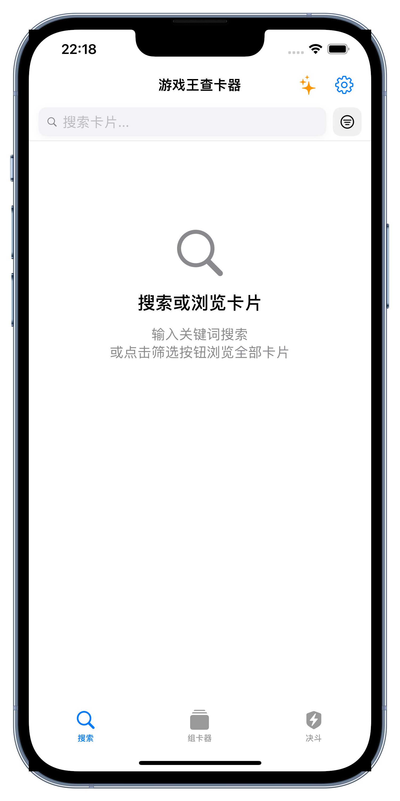
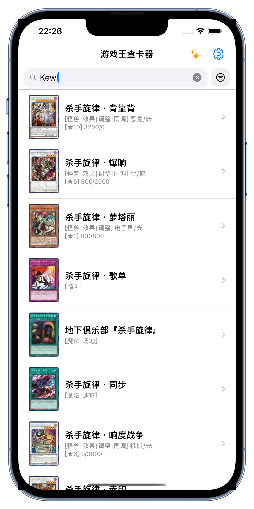
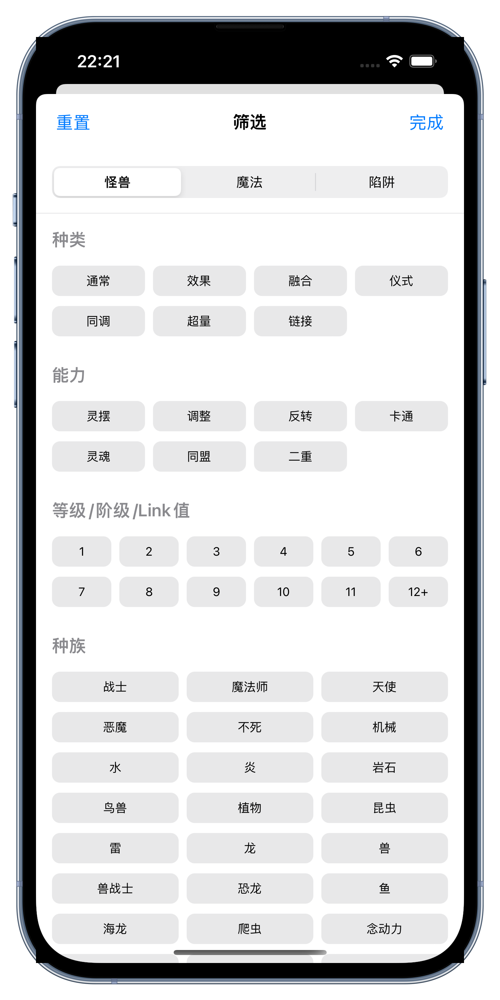
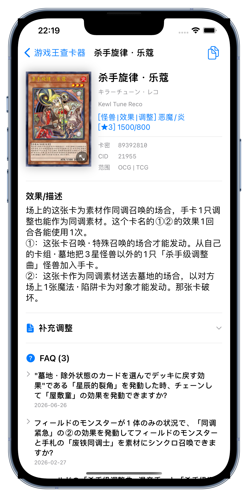
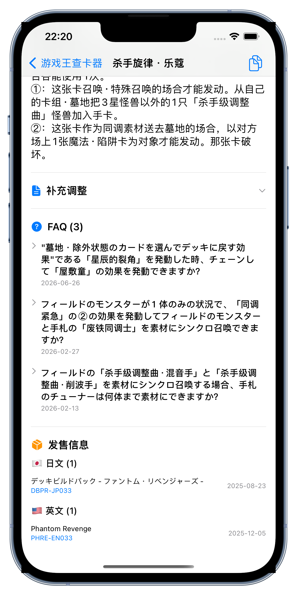
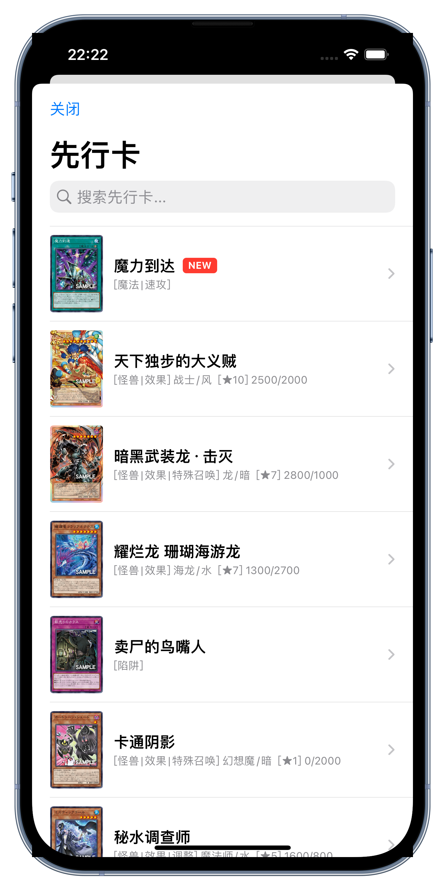
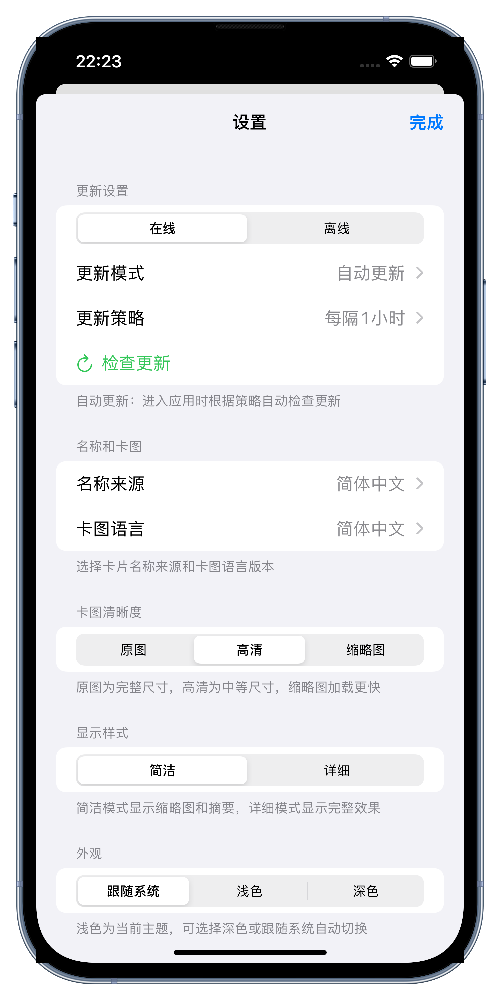

# ygocdb - 游戏王查卡器

一款基于 SwiftUI 开发的游戏王卡片查询 iOS 应用，数据来源于 [ygocdb.com](https://ygocdb.com)。

## 截图展示

<p align="center">
  
  
  
  
  
  
  
</p>

## 功能特性

- 🔍 **全文搜索**：支持中/日/英多语言卡名、密码、效果文本搜索
- 📜 **搜索历史**：自动保存近5条搜索记录，支持一键清空
- 📚 **文本复制**：支持复制卡片名称、密码、效果文本，卡图保存分享
- 🎯 **高级筛选**：按卡片类型（怪兽/魔法/陷阱）、种族、属性等筛选
- ⭐ **先行卡查看**：实时获取最新的先行卡片信息
- 🖼️ **多语言卡图**：支持 YGOPRO/简中/日文/英文卡图切换
- 📝 **多来源名称**：YGOPRO/简中/Master Duel/NWBBS/CNOCG 名称可选
- ⚡ **自动更新**：支持自动/手动更新策略，可配置更新间隔
- 📵 **离线支持**：下载后可完全离线使用
- 🃏 **卡组构建**：支持创建、编辑、从剪贴板导入/导出卡组
- 📊 **概率计算**：内置起手概率计算器，支持自定义特定手牌组合概率分析
- ⚖️ **Side 策略**：换 Side 策略辅助，记录换备方案
- 🎲 **模拟抽卡**：卡组试抽功能 (Hand Test)

## 技术架构

### 架构模式

采用 **MVVM** (Model-View-ViewModel) 架构模式：

```
┌─────────────────────────────────────────────────────────────────────────┐
│                                 Views                                   │
│  SearchView · CardDetailView · DeckBuilderView · SideboardStrategyView  │
└────────────────────────────────────┬────────────────────────────────────┘
                                     │
┌────────────────────────────────────▼────────────────────────────────────┐
│                               ViewModels                                │
│ CardSearchViewModel · CardDetailViewModel · DeckBuilderViewModel        │
└────────────────────────────────────┬────────────────────────────────────┘
                                     │
┌────────────────────────────────────▼────────────────────────────────────┐
│                       Repository / Services                             │
│       CardRepository · DeckService · ProbabilityCalculator              │
└─────────────────────────────────────────────────────────────────────────┘
```

### 目录结构

ygocdb/
├── Models/                 # 数据模型
│   ├── Card.swift          # 卡片核心模型
│   ├── Deck.swift          # 卡组模型
│   ├── SideboardStrategy.swift # Side 策略模型
│   ├── ProbabilityScenario.swift # 概率计算场景
│   └── ...
├── Repository/
│   └── CardRepository.swift# 卡片数据仓库
├── Services/
│   ├── DeckService.swift   # 卡组管理服务
│   ├── ProbabilityCalculator.swift # 概率计算服务
│   ├── YGODBService.swift  # API 服务
│   └── ...
├── ViewModels/
│   ├── CardSearchViewModel.swift
│   ├── DeckBuilderViewModel.swift
│   └── ...
├── Views/
│   ├── SearchView.swift    # 主搜索界面
│   ├── DeckBuilderView.swift # 卡组构建
│   ├── ProbabilityCalcView.swift # 概率计算
│   ├── SideboardStrategyView.swift # Side 策略
│   ├── HandTestView.swift  # 试抽界面
│   └── ...
└── ygocdbApp.swift         # 应用入口
```

## 核心模块

### Models

#### Card
卡片核心数据模型，存储卡片的基本信息：
- 多语言卡名（中/日/英/多种中文来源）
- 卡片文本（类型、效果、灵摆效果）
- 卡片数据（攻/防/等级/种族/属性）

#### Settings
应用设置管理器（`AppSettings`），使用 `@AppStorage` 持久化：
- 名称来源、卡图语言、列表样式
- 网络模式、更新策略
- 搜索历史记录

### Repository

#### CardRepository
卡片数据仓库，单例模式（`CardRepository.shared`）：
- 本地 JSON 数据加载/保存
- 全文搜索（支持多语言、效果文本、密码）
- 数据缓存管理

### Services

#### YGODBService
ygocdb.com API 封装（Actor）：
- 获取资源 MD5 校验更新
- 下载并解压 cards.zip
- 获取卡片详情

#### ImageCache
图片缓存服务：
- 基于 NSCache 的内存缓存
- 磁盘持久化存储
- 自动清理机制

## 设置选项

| 设置项 | 选项 |
|--------|------|
| 名称来源 | YGOPRO / 简体中文 / Master Duel / NWBBS / CNOCG |
| 卡图语言 | YGOPRO / 简体中文 / 日文 / 英文 |
| 列表样式 | 简洁 / 详细 |
| 详情卡图 | 原图 / 高清 / 缩略图 |
| 网络模式 | 在线 / 离线 |
| 更新模式 | 自动更新 / 手动更新 |
| 更新策略 | 每隔1小时 / 24小时 / 7天 |

## 系统要求

- iOS 15.0+
- Xcode 14.0+
- Swift 5.0+

## 数据来源

- 卡片数据：[ygocdb.com](https://ygocdb.com)

## 许可证

MIT License
