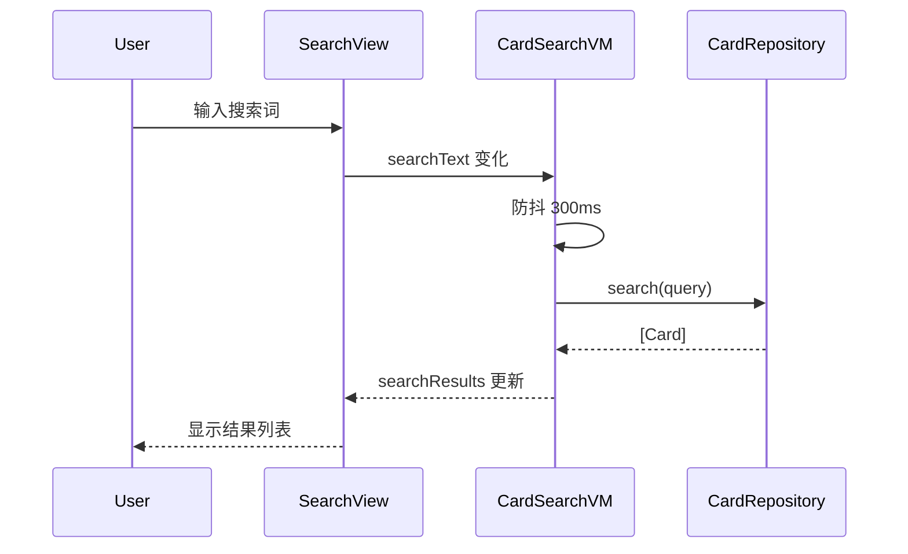
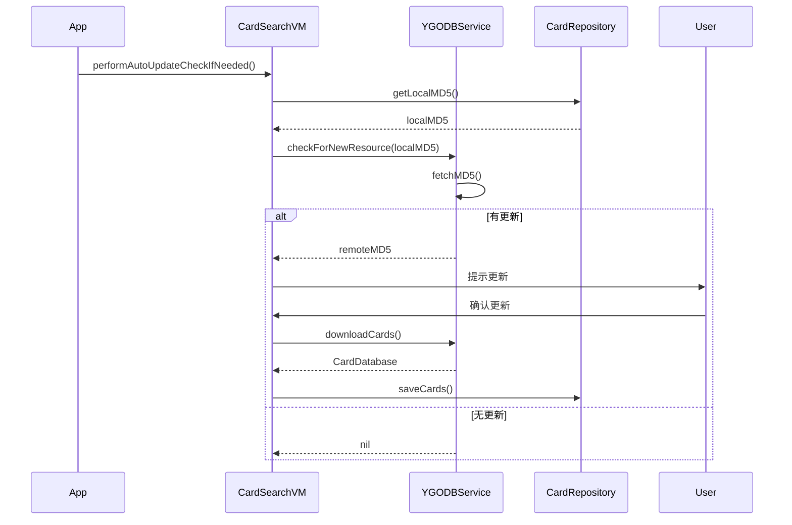

# 架构设计文档

## 整体架构

应用采用 **MVVM** 架构模式，结合 Swift Concurrency 和 Combine 框架。

```
┌──────────────────────────────────────────────────────────────────┐
│                          Presentation Layer                       │
│  ┌────────────┐ ┌────────────┐ ┌────────────┐ ┌────────────────┐ │
│  │ SearchView │ │ DetailView │ │ SettingsV. │ │ PreReleaseView │ │
│  └─────┬──────┘ └─────┬──────┘ └─────┬──────┘ └───────┬────────┘ │
└────────┼──────────────┼──────────────┼────────────────┼──────────┘
         │              │              │                │
┌────────▼──────────────▼──────────────▼────────────────▼──────────┐
│                          ViewModel Layer                          │
│  ┌─────────────────┐ ┌─────────────────┐ ┌─────────────────────┐ │
│  │CardSearchVM     │ │CardDetailVM     │ │PreReleaseCardVM     │ │
│  │- searchText     │ │- cardDetail     │ │- cards              │ │
│  │- searchResults  │ │- isLoading      │ │- isLoading          │ │
│  └────────┬────────┘ └────────┬────────┘ └──────────┬──────────┘ │
└───────────┼───────────────────┼─────────────────────┼────────────┘
            │                   │                     │
┌───────────▼───────────────────▼─────────────────────▼────────────┐
│                          Domain Layer                             │
│  ┌─────────────────────────┐ ┌─────────────────────────────────┐ │
│  │     CardRepository      │ │         AppSettings             │ │
│  │- cards: [Card]          │ │- cardNameSource                 │ │
│  │- search()               │ │- cardImageLanguage              │ │
│  │- loadCards()            │ │- searchHistory                  │ │
│  └───────────┬─────────────┘ └─────────────────────────────────┘ │
└──────────────┼───────────────────────────────────────────────────┘
               │
┌──────────────▼───────────────────────────────────────────────────┐
│                          Data Layer                               │
│  ┌─────────────────┐ ┌─────────────────┐ ┌────────────────────┐  │
│  │  YGODBService   │ │   ImageCache    │ │PreReleaseCardSvc.  │  │
│  │  (Actor)        │ │   (Actor)       │ │(Actor)             │  │
│  └─────────────────┘ └─────────────────┘ └────────────────────┘  │
└──────────────────────────────────────────────────────────────────┘
```

## 层次职责

### Presentation Layer

负责 UI 渲染和用户交互。所有视图使用 SwiftUI 构建。

| 组件 | 职责 |
|------|------|
| SearchView | 主搜索界面，包含搜索栏和卡片列表 |
| CardDetailView | 卡片详情展示 |
| SettingsView | 应用设置 |
| CardRowView | 列表行组件 |
| CardFilterView | 筛选面板 |

### ViewModel Layer

处理业务逻辑，连接 View 和 Domain 层。

| 组件 | 职责 |
|------|------|
| CardSearchViewModel | 搜索逻辑、防抖处理、自动更新检查 |
| CardDetailViewModel | 详情加载、状态管理 |
| PreReleaseCardViewModel | 先行卡加载 |

### Domain Layer

核心业务逻辑和数据管理。

| 组件 | 职责 |
|------|------|
| CardRepository | 卡片数据存储、检索、本地缓存 |
| AppSettings | 应用配置管理 |
| CardFilter | 筛选条件模型 |

### Data Layer

网络请求和本地存储。

| 组件 | 职责 |
|------|------|
| YGODBService | API 请求封装 |
| ImageCache | 图片缓存（内存+磁盘） |
| PreReleaseCardService | 先行卡 API |

## 核心流程

### 搜索流程



### 数据更新流程



## 关键设计决策

### 1. 使用 Actor 保证线程安全

`YGODBService` 和 `ImageCache` 使用 Swift Actor，确保并发访问的安全性。

### 2. 单例模式配合 @MainActor

`CardRepository` 和 `AppSettings` 使用单例模式，配合 `@MainActor` 确保 UI 更新在主线程。

### 3. 搜索防抖

使用 Combine 的 `debounce` 操作符，避免频繁搜索导致的性能问题。

```swift
$searchText
    .debounce(for: .milliseconds(300), scheduler: DispatchQueue.main)
    .sink { [weak self] query in
        self?.performSearch(query: query)
    }
```

### 4. 图片缓存策略

- **内存缓存**：NSCache 自动管理
- **磁盘缓存**：存储在 Caches 目录
- **按需加载**：使用 AsyncImage 封装的 CachedAsyncImage

### 5. 离线优先

- 首次启动下载全量数据到本地
- 后续使用本地数据，按策略检查更新
- 支持完全离线使用
